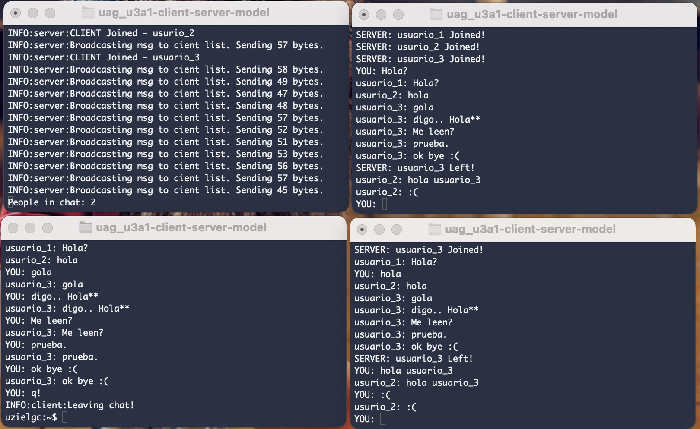

## U3 A1: Modelo cliente-servidor.

### Author: Eloy Uziel García Cisneros (eloy.garcia@edu.uag.mx)
#### Repo: https://github.com/uzielgc/uag_u3a1-client-server-model

## Documentación

El código fuente se encuentra dentro de la carpeta [src](src).
La evidencia en imagenes/video se encuentra en la carpeta [media](media).
El código esta comentado en los puntos clave del proceso.

El código consta de 3 modulos:
    * server.py Contiene la lógica de los servidor. (Recepción de mensajes)
    * client.py Contiene la lógica del cliente. (Envío de mensajes y sobreescribe codigo de servidor.)
    * node.py Ejecutable, inicializa los procesos.

Message broker (main server) y 3 nodos corriendo sumultaneamente (cliente + servidor)



Enlace al video demo:


### Validación/Uso

Correr message broker (para distribuir mensajes a todos los clientes):
    `python src/node.py -s`

Correr clientes:
    `python src/node.py`

### Ooutput

Terminal 1 (message broker/server):
```
uzielgc:~$ python src/node.py -s
INFO:server:Initializing UDPServer...
INFO:server:Server will listen on port 20001
INFO:server:CLIENT Joined - usuario_1
INFO:server:Broadcasting msg to cient list. Sending 58 bytes.
INFO:server:CLIENT Joined - usurio_2
INFO:server:Broadcasting msg to cient list. Sending 57 bytes.
INFO:server:CLIENT Joined - usuario_3
INFO:server:Broadcasting msg to cient list. Sending 58 bytes.
INFO:server:Broadcasting msg to cient list. Sending 49 bytes.
INFO:server:Broadcasting msg to cient list. Sending 47 bytes.
INFO:server:Broadcasting msg to cient list. Sending 48 bytes.
INFO:server:Broadcasting msg to cient list. Sending 57 bytes.
INFO:server:Broadcasting msg to cient list. Sending 52 bytes.
INFO:server:Broadcasting msg to cient list. Sending 51 bytes.
INFO:server:Broadcasting msg to cient list. Sending 53 bytes.
INFO:server:Broadcasting msg to cient list. Sending 56 bytes.
INFO:server:Broadcasting msg to cient list. Sending 57 bytes.
INFO:server:Broadcasting msg to cient list. Sending 45 bytes.
People in chat: 2
```

Terminal 2 (usuario 1, primero en unirse):
```
uzielgc:~$ python src/node.py 
INFO:server:Initializing UDPServer...
INFO:server:Server will listen on port 20186
Enter User Name:usuario_1
SERVER: usuario_1 Joined!
SERVER: usurio_2 Joined!
SERVER: usuario_3 Joined!
YOU: Hola?
usuario_1: Hola?
usurio_2: hola
usuario_3: gola
usuario_3: digo.. Hola**
usuario_3: Me leen?
usuario_3: prueba.
usuario_3: ok bye :(
SERVER: usuario_3 Left!
usurio_2: hola usuario_3
usurio_2: :(
YOU: 
```

Terminal 3 (usuario 2, segundo en unirse):
```
uzielgc:~$ python src/node.py 
INFO:server:Initializing UDPServer...
INFO:server:Server will listen on port 20233
Enter User Name:usurio_2
SERVER: usurio_2 Joined!
SERVER: usuario_3 Joined!
usuario_1: Hola?
YOU: hola
usurio_2: hola
usuario_3: gola
usuario_3: digo.. Hola**
usuario_3: Me leen?
usuario_3: prueba.
usuario_3: ok bye :(
SERVER: usuario_3 Left!
YOU: hola usuario_3  
usurio_2: hola usuario_3
YOU: :(
usurio_2: :(
YOU: 
```

Terminal 3 (usuario 3, último en unirse, primero en salir.):
```
uzielgc:~$ python src/node.py   
INFO:server:Initializing UDPServer...
INFO:server:Server will listen on port 20686
Enter User Name:usuario_3
SERVER: usuario_3 Joined!
usuario_1: Hola?
usurio_2: hola
YOU: gola
usuario_3: gola
YOU: digo.. Hola**
usuario_3: digo.. Hola**
YOU: Me leen?
usuario_3: Me leen?
YOU: prueba.
usuario_3: prueba.
YOU: ok bye :(
usuario_3: ok bye :(
YOU: q!
INFO:client:Leaving chat!
```